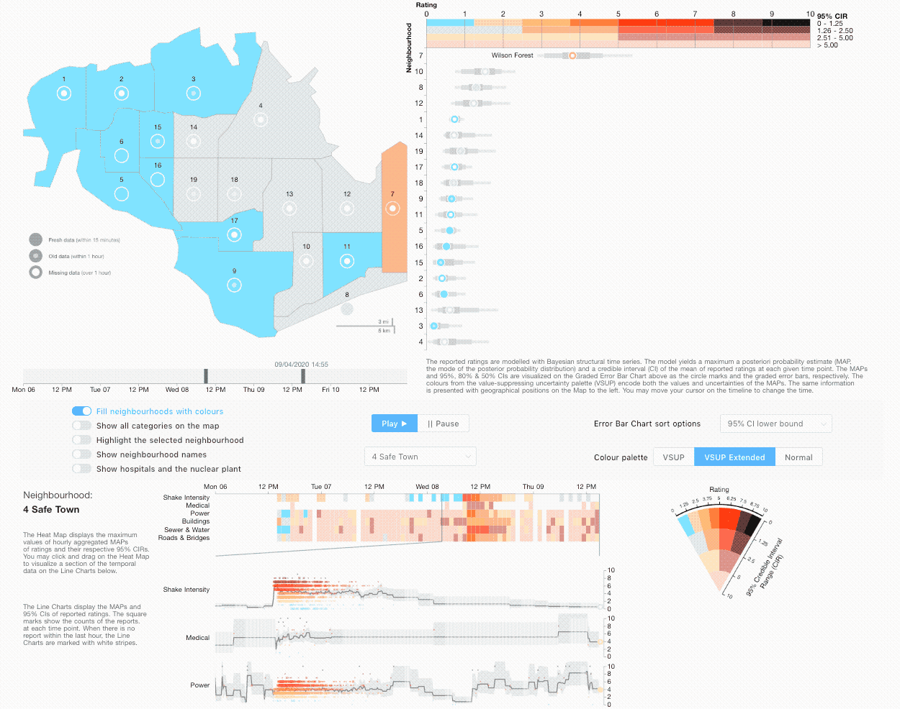
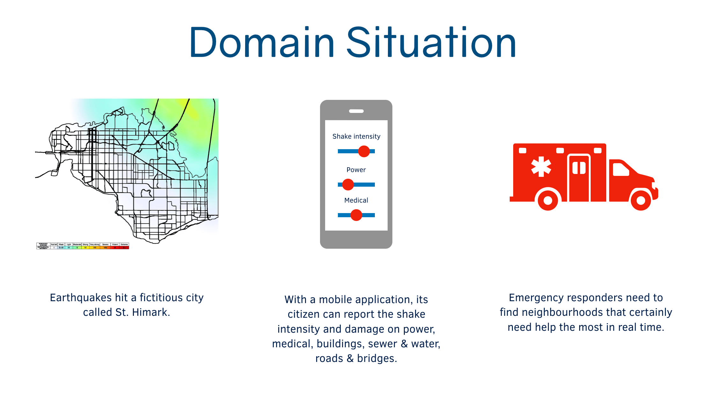
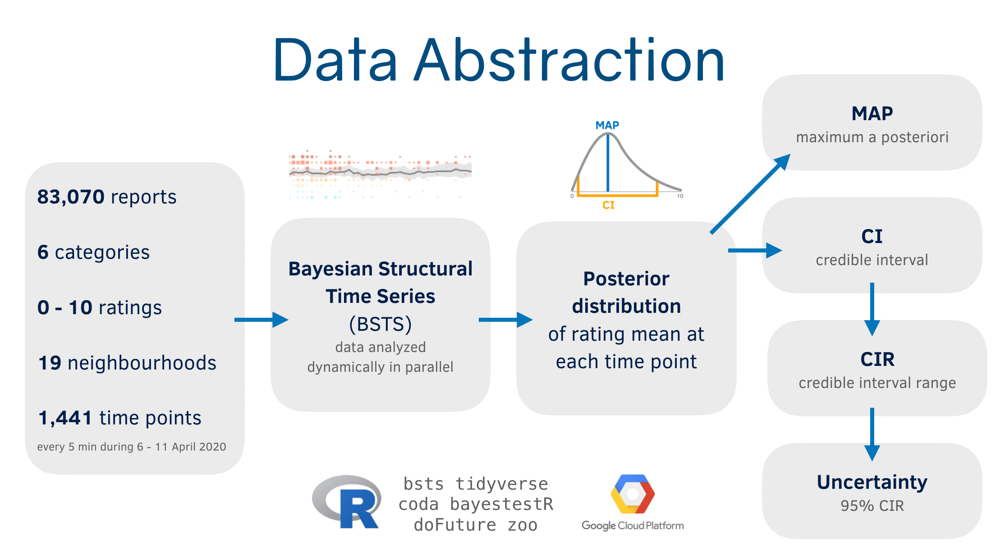

# Earthquake Damage Report Interactive Dashboard

This project is a submission to Visual Analytics Science and Technology (VAST) Challenge 2019 (Mini Challege 1).

Live website: [https://vast2019.maxnadul.com](https://vast2019.maxnadul.com)

Project submission package: [Summary Presentation](https://www.youtube.com/watch?v=s28CX9V8pRI), [Answer](https://vast2019.maxnadul.com/answer/dpst-natthawut-mc1)

The majority of codebase can be found in [`nuxt`](nuxt) directory.

## Overview

[Source](https://vast-challenge.github.io/2019/index.html)

_Note: This scenario and all the people, places, groups, technologies, contained therein are fictitious. Any resemblance to real people, places, groups, or technologies is purely coincidental._

St. Himark is a vibrant community located in the Oceanus Sea. Home to the world-renowned St. Himark Museum, beautiful beaches, and the Wilson Forest Nature Preserve, St. Himark is one of the region’s best cities for raising a family and provides employment across a number of industries including the Always Safe Nuclear Power Plant. Well, all that was true before the disastrous earthquake that hits the area during the course of this year’s challenge. Mayor Jordan, city officials, and emergency services are overwhelmed and are desperate for assistance in understanding the true situation on the ground and how best to deploy the limited resources available to this relatively small community.

## Mini-Challenge 1

[Source](https://vast-challenge.github.io/2019/MC1.html)

St. Himark has been hit by an earthquake, leaving officials scrambling to determine the extent of the damage and dispatch limited resources to the areas in most need. They quickly receive seismic readings and use those for an initial deployment but realize they need more information to make sure they have a realistic understanding of the true conditions throughout the city.

In a prescient move of community engagement, the city had released a new damage reporting mobile application shortly before the earthquake. This app allows citizens to provide more timely information to the city to help them understand damage and prioritize their response. In this mini-challenge, use app responses in conjunction with shake maps of the earthquake strength to identify areas of concern and advise emergency planners.

With emergency services stretched thin, officials are relying on citizens to provide them with much needed information about the effects of the quake to help focus recovery efforts.

By combining seismic readings of the quake, responses from the app, and background knowledge of the city, help the city triage their efforts for rescue and recovery.

#### Data description

The data for MC1 includes [one (CSV) file](data/mc1-reports-data.csv) spanning the entire length of the event, containing (categorical) individual reports of shaking/damage by neighborhood over time. Reports are made by citizens at any time, however, they are only recorded in 5-minute batches/increments due to the server configuration. Furthermore, delays in the receipt of reports may occur during power outages.
mc1-reports-data.csv fields: - time: timestamp of incoming report/record, in the format YYYY-MM-DD hh:mm:ss - location: id of neighborhood where person reporting is feeling the shaking and/or seeing the damage - {shake_intensity, sewer_and_water, power, roads_and_bridges, medical, buildings}: reported categorical value of how violent the shaking was/how bad the damage was (0 - lowest, 10 - highest; missing data allowed)

Also included are two shakemap (PNG) files which indicate where the corresponding earthquakes' epicenters originate as well as how much shaking can be felt across the city.
